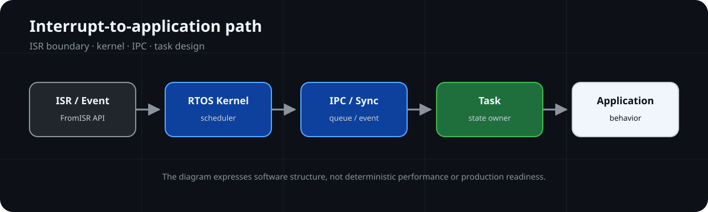
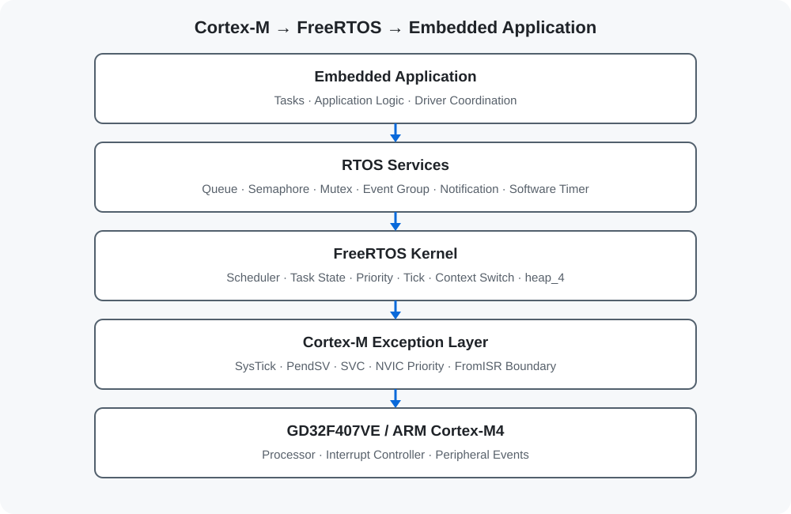

# FreeRTOS-Embedded-Lab

面向 Cortex-M 的 FreeRTOS 调度、同步、IPC 与 ISR-to-task 架构文档实验。

**🧵 Execution Model**



## Execution Snapshot

| RTOS Focus | Current Scope |
| --- | --- |
| Repository Type | RTOS Architecture Lab |
| Reference Kernel | FreeRTOS V10.5.1 concepts |
| Execution Model | Priority scheduling、task states、Software Timer |
| IPC Model | Queue、Semaphore、Mutex、Event Group、Task Notification |
| Public Implementation | Not included in the current default branch |
| Verification | Architecture review；build, timing and hardware evidence not provided |

## 📌 Overview

仓库以原创文档和 SVG 说明 FreeRTOS 任务生命周期、优先级调度、Software Timer、Queue、Semaphore、Mutex、Event Group、Task Notification 与 ISR-to-task 协作。

当前默认分支不分发课程应用、平衡球参考工程、FreeRTOS Kernel 副本、CMSIS、GigaDevice 库或 Keil/RTE 工程。仓库不据此声明确定性性能、线程安全保证或生产级实时能力。

## 🏗️ Architecture



```text
Application Tasks
       ↓
Queue / Semaphore / Mutex / Event / Notification
       ↓
FreeRTOS Scheduling Model
       ↓
SysTick / PendSV / SVC / NVIC Boundary
       ↓
Cortex-M Hardware
```

ISR 应只完成必要确认和数据搬运，再通过适用的 `FromISR` API 交给任务处理。具体行为必须由未来实现和测试证明。

## ✨ Key Features

| Capability | Documentation Entry |
| --- | --- |
| Kernel and scheduler model | [Kernel and Scheduler](docs/kernel-and-scheduler.md) |
| Task lifecycle | [Task Management](docs/task-management.md) |
| IPC and data transfer | [Task Communication](docs/task-communication.md) |
| Synchronization boundaries | [Synchronization](docs/synchronization.md) |
| Interrupt handoff | [Cortex-M Interrupts](docs/cortex-m-interrupts.md) |
| Memory and configuration | [Memory Management](docs/memory-management.md) and [Configuration](docs/freertos-configuration.md) |

## 📂 Project Structure

```text
FreeRTOS-Embedded-Lab/
├── README.md
├── LICENSE
├── THIRD_PARTY_NOTICES.md
├── assets/images/  # Repository-authored architecture and flow SVG
└── docs/           # RTOS architecture documentation
```

## 📚 Documentation

- [Kernel and Scheduler](docs/kernel-and-scheduler.md)
- [Task Management](docs/task-management.md)
- [Task Communication](docs/task-communication.md)
- [Synchronization](docs/synchronization.md)
- [Cortex-M Interrupts](docs/cortex-m-interrupts.md)
- [Memory Management](docs/memory-management.md)
- [FreeRTOS Configuration](docs/freertos-configuration.md)
- [Development Environment](docs/development-environment.md)

## 🧪 Verification

| Verification Layer | Status | Boundary |
| --- | --- | --- |
| Host Test | NOT PROVIDED | No public RTOS logic or tests |
| Build Verification | NOT PROVIDED | No current Keil project or kernel source is distributed |
| Hardware Validation | NOT PROVIDED | No reviewable Cortex-M board record |
| Runtime Evidence | NOT PROVIDED | No scheduler trace, timing measurement, or runtime log |

## License Boundary

根目录 MIT License 仅覆盖当前默认分支中仓库维护者编写的文档、配置与自绘 SVG。FreeRTOS、CMSIS、GigaDevice 组件、课程工程和参考应用未包含在当前默认分支；历史提交仍可能包含旧文件。详见 [THIRD_PARTY_NOTICES.md](THIRD_PARTY_NOTICES.md)。
