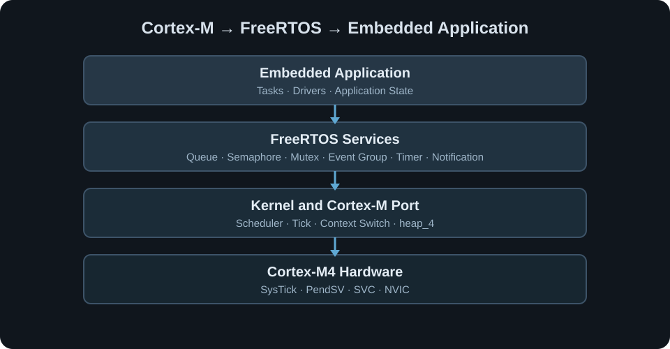

# FreeRTOS 实时系统实验室
## FreeRTOS Embedded Lab

面向 **GD32F407VE / ARM Cortex-M4** 的 FreeRTOS V10.5.1 实时系统工程，关注任务调度、任务间通信、资源同步和中断到任务的事件传递。



## 👋 项目简介 | Overview

仓库保留 17 个递进的 Keil 主线工程，并按 RTOS 机制重新建立导航。工程从任务创建和调度出发，继续覆盖 Software Timer、Semaphore、Mutex、Queue、Event Group、Task Notification，以及 ISR 与任务之间的协作。平衡球工程作为多任务综合参考，用于观察任务拆分、通信和外设协同。

主线平台采用 **GD32 Standard Peripheral Library** 与 FreeRTOS Native API。原始工程位于各模块的 `course/` 目录，文件内容通过 SHA256 与迁移源逐项核对。

## ⚙ 技术范围 | Technical Scope

**Cortex-M Hardware Support**

- SysTick / PendSV / SVC
- NVIC Priority
- FreeRTOS interrupt priority boundary

**FreeRTOS Kernel**

- Dynamic / Static Task Creation
- Priority / Preemption / Tick Delay
- Task Delete / Suspend / Resume
- `heap_4.c`

**RTOS Services**

- Queue / Event Group / Task Notification
- Binary / Counting Semaphore
- Mutex / Recursive Mutex
- Software Timer

**Interrupt Collaboration**

- `FromISR` API
- ISR → Semaphore / Queue / Task Resume
- `pxHigherPriorityTaskWoken` 与任务切换条件

## 🧠 内核与调度 | Kernel & Scheduling

`SysTick` 提供内核时基；就绪任务按优先级参与抢占式调度；`PendSV` 承担 Cortex-M 端口的上下文切换。主线配置使用 1 kHz tick、`heap_4.c` 和动态分配，静态任务创建由独立工程演示。

- [内核与调度](docs/kernel-and-scheduler.md)
- [任务生命周期](docs/task-management.md)
- [FreeRTOSConfig 配置关系](docs/freertos-configuration.md)

## 🔄 任务通信 | Task Communication

- **Queue**：传递整数或结构体数据，分离生产者与消费者。
- **Event Group**：用事件位组合多个状态条件。
- **Task Notification**：直接向指定任务传递计数、位或数值。

详见 [任务通信机制](docs/task-communication.md)。

## 🔒 同步与资源管理 | Synchronization

二值信号量连接事件源与等待任务；计数信号量表示可累计资源；Mutex 与 Recursive Mutex 约束共享资源访问。临界区用于保护短时、不可被调度或中断打断的代码段。

详见 [同步与互斥](docs/synchronization.md) 和 [内存管理](docs/memory-management.md)。

## ⚡ 中断与任务协作 | ISR-to-Task

主线工程包含 `xTaskResumeFromISR()`、`xSemaphoreGiveFromISR()`、`xTimerStartFromISR()` / `xTimerStopFromISR()`；综合参考工程还使用 `xQueueSendFromISR()`。这些路径展示了中断只产生事件、任务负责后续处理的结构。

详见 [Cortex-M 中断与 FreeRTOS](docs/cortex-m-interrupts.md) 和 [ISR-to-Task 工程索引](projects/10-isr-task-communication/README.md)。

## 🚀 核心工程 | Featured Projects

- [Task Basics](projects/01-task-basics/) — FreeRTOS 模板、动态任务和静态任务创建。
- [Task Scheduling](projects/02-task-scheduling/) — 优先级、删除、挂起、恢复与中断恢复任务。
- [Interrupt Priority](projects/03-interrupt-priority/) — NVIC 与可调用 FreeRTOS API 的中断优先级边界。
- [Software Timers](projects/04-software-timers/) — 软件定时器回调及 ISR 控制接口。
- [Semaphores](projects/05-semaphores/) — 二值/计数信号量与事件同步。
- [Mutex](projects/06-mutex/) — 普通/递归互斥量与共享资源访问。
- [Queue](projects/07-queue/) — 基础类型和结构体消息传递。
- [Event Groups](projects/08-event-groups/) — 多事件位同步。
- [Task Notifications](projects/09-task-notifications/) — 任务直接通知的多种更新方式。
- [Integrated Reference Project](projects/11-system-reference/) — Queue、Semaphore、UART ISR 与多任务协作。

## 📂 工程结构 | Repository Structure

```text
FreeRTOS-Embedded-Lab/
├── assets/images/              # 架构图、流程图与硬件参考图
├── docs/                       # 内核、调度、通信、同步和环境说明
├── projects/                   # 按 RTOS 机制组织的代表工程
│   ├── 01-task-basics/
│   ├── 02-task-scheduling/
│   ├── ...
│   ├── 10-isr-task-communication/
│   └── 11-system-reference/
├── SOURCE_SELECTION_MANIFEST.csv
└── MIGRATION_HASH_VERIFICATION.csv
```

每个包含原始工程的模块使用 `course/` 保存源码；仓库级 README 与 `docs/` 负责解释工程之间的机制关系。

## 🛠 开发环境 | Development Environment

- MCU：GD32F407VE / GD32F470ZG（ARM Cortex-M4）
- IDE：Keil MDK-ARM
- Device support：GigaDevice GD32F4xx DFP
- Peripheral library：GD32 Standard Peripheral Library
- RTOS：FreeRTOS V10.5.1

打开模块内的 `.uvprojx` 工程后，按工程声明安装对应 device pack 并选择调试器。详细要求见 [开发环境](docs/development-environment.md)。当前仓库未记录自动化 Keil 构建结果。

## 📖 技术文档 | Documentation

- [Kernel and Scheduler](docs/kernel-and-scheduler.md)
- [Task Management](docs/task-management.md)
- [Cortex-M Interrupts](docs/cortex-m-interrupts.md)
- [Task Communication](docs/task-communication.md)
- [Synchronization](docs/synchronization.md)
- [Memory Management](docs/memory-management.md)
- [FreeRTOS Configuration](docs/freertos-configuration.md)
- [Development Environment](docs/development-environment.md)

## 📜 来源与许可 | License

来源与第三方组件说明见 [THIRD_PARTY_NOTICES.md](THIRD_PARTY_NOTICES.md)。仓库新增的原创文档和图示采用 [MIT License](LICENSE)；`projects/**/course/` 中的工程及第三方组件遵循其原有声明。

