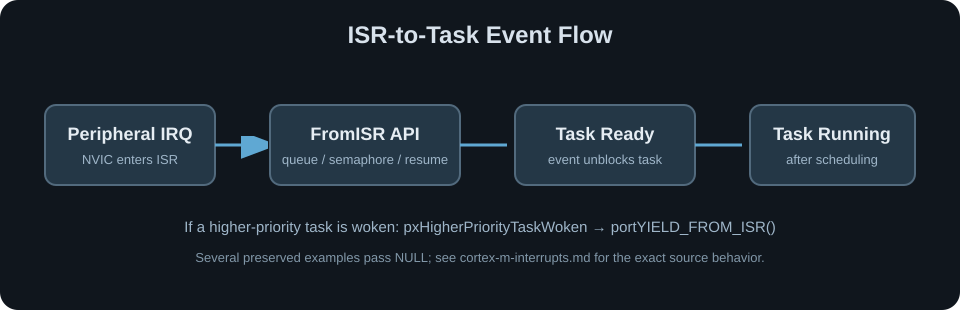

# Cortex-M 中断与 FreeRTOS | Interrupts and FreeRTOS

> [仓库首页](../README.md) · [内核与调度](kernel-and-scheduler.md)

FreeRTOS 的 Cortex-M 端口建立在异常、NVIC 优先级和任务栈切换机制之上。这里关注硬件机制如何为实时调度服务，不重复 GPIO、UART 等外设基础配置。

## 异常分工

```text
Cortex-M Exception
        ↓
SysTick：更新 tick，并判断是否需要调度
        ↓
PendSV：保存当前任务上下文、选择并恢复下一任务
        ↓
Task：在线程模式继续运行
```

SVC 用于从线程模式进入特权服务并启动首个任务。端口层通过 `FreeRTOSConfig.h` 中的 handler 映射接管这三个异常入口。

## NVIC 优先级边界

代表配置使用：

```c
#define configLIBRARY_LOWEST_INTERRUPT_PRIORITY         15
#define configLIBRARY_MAX_SYSCALL_INTERRUPT_PRIORITY     5
```

两者经过 `configPRIO_BITS` 左移形成 `configKERNEL_INTERRUPT_PRIORITY` 与 `configMAX_SYSCALL_INTERRUPT_PRIORITY`。数值更小表示更高的硬件优先级。

- 内核异常运行在最低可配置优先级。
- 调用 FreeRTOS `FromISR` API 的中断，其优先级必须处于内核允许屏蔽和管理的范围。
- 高于该边界的紧急中断不能调用这些内核 API。

## ISR-to-Task



典型的即时切换模式是：

```c
BaseType_t task_woken = pdFALSE;
/* xQueueSendFromISR / xSemaphoreGiveFromISR / ... */
portYIELD_FROM_ISR(task_woken);
```

是否请求即时切换取决于 `pxHigherPriorityTaskWoken` 和端口宏的使用。设计审查需要区分“事件已提交”与“事件提交后立即让出 CPU”；当前默认分支不包含可运行示例来证明其中任一路径。

## 相关内容

- `configKERNEL_INTERRUPT_PRIORITY` 与系统调用边界：[freertos-configuration.md](freertos-configuration.md)
- Queue、Event Group 和 Task Notification：[task-communication.md](task-communication.md)

