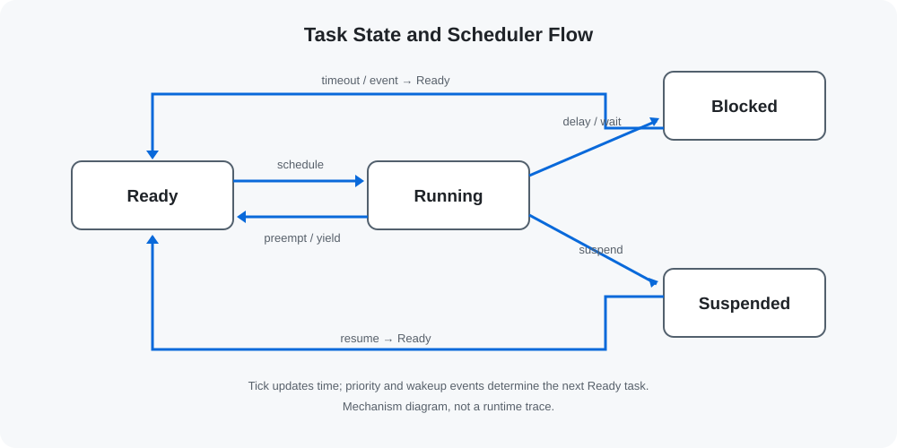

# 任务管理 | Task Management

> [仓库首页](../README.md) · [内核与调度](kernel-and-scheduler.md) · [内存管理](memory-management.md)

主线工程将任务生命周期拆成独立步骤，便于观察创建方式、状态迁移和句柄的作用。

## 创建

`03_FreeRTOS_create_task` 使用 `xTaskCreate()`，栈和 TCB 由 FreeRTOS heap 分配；`04_FreeRTOS_create_task_static` 使用 `xTaskCreateStatic()`，由应用提供任务栈和 `StaticTask_t`。

两种方式产生相同的调度对象，区别在于存储由谁提供和生命周期如何管理。

## 删除、挂起与恢复

- `vTaskDelete()` 结束指定任务或当前任务。
- `vTaskSuspend()` 将任务转入 Suspended。
- `vTaskResume()` 从任务上下文恢复任务。
- `xTaskResumeFromISR()` 从中断上下文恢复任务，并返回是否需要切换到更高优先级任务。

`07_FreeRTOS_operation2` 同时包含任务侧恢复和 ISR 恢复路径，并在 `xTaskResumeFromISR()` 返回真时调用 `portYIELD_FROM_ISR()`。

## 延时与周期任务

主线应用使用 `vTaskDelay()` 产生相对延时。检索到的代表性应用没有使用 `vTaskDelayUntil()` 构造固定相位的周期任务，因此本仓库不把绝对周期调度描述为已完成工程。

## 优先级

工程在创建任务时传入固定优先级，展示高优先级任务就绪后的抢占关系。主线应用未形成运行时调用 `vTaskPrioritySet()` 的独立实践。

## 代码入口

- [动态与静态创建](../projects/01-task-basics/)
- [任务操作与调度](../projects/02-task-scheduling/)

## 相关内容

- TCB、Tick 与抢占关系：[kernel-and-scheduler.md](kernel-and-scheduler.md)
- 动态创建对应的 `heap_4.c`：[memory-management.md](memory-management.md)
- ISR 恢复任务及切换条件：[cortex-m-interrupts.md](cortex-m-interrupts.md)

